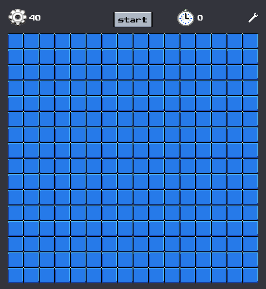

	
	&nbsp;&nbsp;&nbsp;
	
	&nbsp;&nbsp;&nbsp;
	

# Godot Minesweeper Clone
A simple Minesweeper-inspired game built with [Godot Engine](https://godotengine.org).
This was made with the goal of improving my Godot skills, and I'm sharing it in hope that my code serves as an inspiration to other aspiring game devs, feel free to copy, share, redistribute, or do anything you want with it.

If you want to reach out to me for whichever reason, my social are linked at the top of this page, and my dms are open :).

I'll be uploading more games in the future, so please follow if you want to be notified.

	

## Features
- Classic Minesweeper gameplay.
- Customizable board size and difficulty.
- Integrated audio and visual assets.

## How to Play
- Left-click to reveal a tile
- Right-click to place/remove a flag
- Use both mouse buttons simultaneously on a revealed number to quickly reveal adjacent tiles (if correct number of flags are placed)
- Avoid hitting mines while uncovering all non-mine tiles to win!

## Setup
1. Clone this repository.
2. Open [project.godot](project.godot) in Godot 4.x.
3. Run the project in the Godot editor.

## Assets Used
This game was made using several assets I got from [itch.io](https://itch.io/game-assets/) and [opengameart.org](https://opengameart.org/).
Thank you so much to all asset creators for your generosity!! ♥

Here's a full list of the assets used:

**Complete UI Essential Pack Free**
- Author: Crusenho Agus Hennihuno
- Source: https://crusenho.itch.io
- License: https://creativecommons.org/licenses/by/4.0/

**Happy Adventure**
- Author: TinyWorlds
- Source: https://opengameart.org/content/happy-adventure-loop
- License: https://creativecommons.org/publicdomain/zero/1.0/

**Minesweeper Tile Set**
- Author: eugeneloza
- Source: https://opengameart.org/content/minesweeper-tile-set-lazarus
- License: https://creativecommons.org/publicdomain/zero/1.0/

**FREE 8BIT SFX Pack**
- Author: lmglolo
- Source: https://lmglolo.itch.io/free-8bit-sfx
- License: https://creativecommons.org/licenses/by-nd/4.0/

**2D Highlight Effect**
- Author: Lenrow
- Source: https://godotshaders.com/shader/2d-highlight-effect/
- License: https://creativecommons.org/publicdomain/zero/1.0/

## License
This project is licensed under the Apache 2 License. See [LICENSE](LICENSE) for details.
